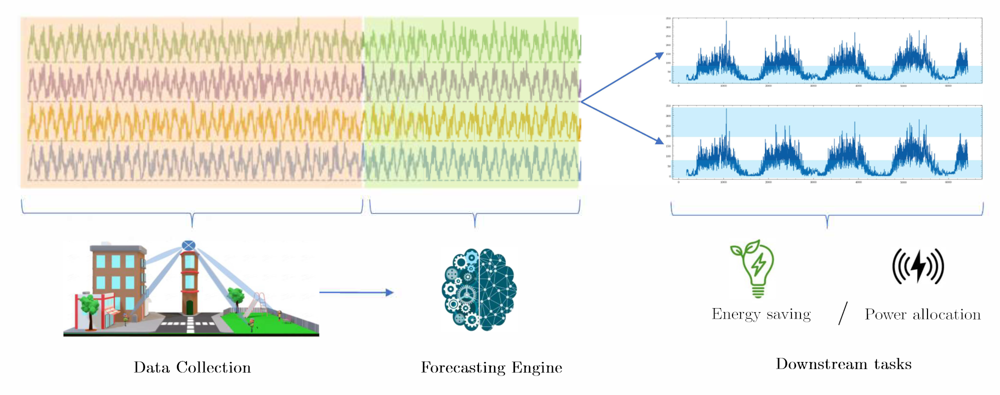

<div align="center">
<h1>Goal-Oriented Time-Series Forecasting: Foundation Framework Design </h1>
<p align="center">

</p>
   
[](https://arxiv.org/abs/2502.10235)
[](https://huggingface.co/papers/2502.10235)
[](https://opensource.org/license/MIT)
[]()

</div>
This repository contains the official implementation of the paper:

   >L. Fechete*†, M. Sana†, F. Ayed†, N. Piovesan†, W. Li†, A. De Domenico†, T. Si Salem†‡. Goal-Oriented Time-Series Forecasting: Foundation Framework Design.
   ><br> * École Polytechnique, Palaiseau, France (Research Intern); † Paris Research Center, Huawei Technologies, Boulogne-Billancourt, France; ‡ Lead Researcher for this study.

## 📝 Abstract:
Traditional time-series forecasting often focuses only on minimizing prediction errors, ignoring the specific requirements of real-world applications that employ them. This paper presents a new training methodology, which allows a forecasting model to dynamically adjust its focus based on the importance of forecast ranges specified by the end application. Unlike previous methods that fix these ranges beforehand, our training approach breaks down predictions over the entire signal range into smaller segments, which are then dynamically weighted and combined to produce accurate forecasts. We tested our method on standard datasets, including a new dataset from wireless communication, and found that not only it improves prediction accuracy but also improves the performance of end application employing the forecasting model. This research provides a basis for creating forecasting systems that better connect prediction and decision-making in various practical applications.



## 📁 Directory structure
```
gotsf/
├── data_provider/                # Data loaders & preprocessors  
├── dataset/wireless/             # Raw wireless CSV time-series  
├── experiments/                  # Training files (normal, uniform and discrete training)
├── layers/                       # Custom Transformer & attention layers  
├── model/                        # Core iTransformer implementation  
├── scripts/                      
│   ├── script_train.py          
│   ├── script_stats.py          
│   ├── script_viz.py            
│   └── multivariate_forecasting/ 
│       └── Wireless/             # train.sh, stats.sh, viz.sh  
├── utils/                        # Metrics, logging, checkpoint helpers  
├── Synthetic_Dataset.ipynb       # Synthetic data generation python scripts  
├── Viz_Wireless.ipynb            # Wireless-specific visualizations  
├── Viz_results.ipynb             # General result exploration  
├── requirements.txt              # Python dependencies  
├── LICENSE                       # MIT License  
└── README.md                     # This file
```
## 🚀 Installation
To set up and run the experiments, begin by installing the necessary dependencies using pip with the provided `requirements.txt` file: `pip install -r requirements.txt`. Subsequently, execute the training script located at `scripts/multivariate_forecasting/Wireless/train.sh`, providing the desired loss function (`MAE` or `MSE`) as a command-line argument to initiate the training of the four models detailed in the paper. After training, model evaluation on a specific interval can be performed by running the `stats.sh` script, also located in the same directory, with the desired evaluation interval's lower (`eval_l`) and upper (`eval_u`) bounds specified as command-line arguments. Finally, to reproduce the visualizations presented in the paper, execute the `viz.sh` script found within the same directory structure.


## 💡 Usage Exmaple
The provided shell scripts illustrate the training configurations for two distinct interval-emphasis strategies.

*Continuous-Interval Training Policy (C-Policy).* 
```
python -u script_train.py \
    --root_path "<ROOT_PATH>" \             # Path to the dataset root directory  
    --data_path "<DATA_FILENAME>" \         # Filename of the CSV or data file to load  
    --experiment_name "<EXPERIMENT_NAME>" \ # Unique name to tag this experiment’s outputs  
    --model_id "<MODEL_ID>" \               # Identifier for this model variant (e.g., “Uniform”)  
    --model "<MODEL_NAME>" \                # Model architecture to use (e.g., “DLinear”)  
    --data "<DATASET_ALIAS>" \              # Alias for the dataset (e.g., “custom”)  
    --features "<FEATURE_SET>" \            # Feature selection mode (e.g., “M” for multivariate)  
    --seq_len <SEQUENCE_LENGTH> \           # Length of input history window (in time steps)  
    --pred_len <PREDICTION_HORIZON> \       # Number of future steps to forecast  
    --e_layers <ENCODER_LAYERS> \           # Number of encoder layers in the model  
    --enc_in <ENC_INPUT_DIM> \              # Dimensionality of encoder input channels  
    --dec_in <DEC_INPUT_DIM> \              # Dimensionality of decoder input channels  
    --c_out <OUTPUT_DIM> \                  # Dimensionality of model output channels  
    --des "<DESCRIPTION_TAG>" \             # Short descriptor for logging/outputs  
    --d_model <MODEL_DIM> \                 # Embedding dimension inside Transformer blocks  
    --d_ff <FEEDFORWARD_DIM> \              # Hidden size of feed-forward sublayers  
    --itr <NUM_ITERATIONS> \                # Number of independent training runs to average  
    --n_heads <NUM_HEADS> \                 # Number of attention heads (Transformer only)  
    --batch_size <BATCH_SIZE> \             # Number of samples per training batch  
    --lradj type3 \                         # Learning-rate adjustment strategy (preset “type3”)  
    --learning_rate <LR> \                  # Initial optimizer learning rate  
    --training_interval_technique "interval-uniform" \  # Interval-emphasis mode  
    --dropout <DROPOUT_RATE> \              # Dropout probability for regularization  
    --w_hat <WEIGHT_FACTOR> \               # Weight parameter for uniform intervals  
    --train_epochs <EPOCHS> \               # Total number of training epochs  
    --train_interval_l <INTERVAL_LOWER> \   # Lower bound of sub-intervals (inclusive)  
    --train_interval_u <INTERVAL_UPPER> \   # Upper bound of sub-intervals (exclusive)  
    --loss "<LOSS_FUNCTION>" &              # Loss function to optimize (e.g., “MSE”)
```
*Patching-Augmented Discretized Training Policy ($D^\star_L$-Policy).*
```
python -u script_train.py \
    --root_path "<ROOT_PATH>" \               # Path to the dataset root directory  
    --data_path "<DATA_FILENAME>" \           # Filename of the CSV or data file to load  
    --experiment_name "<EXPERIMENT_NAME>" \   # Unique tag for this experiment’s outputs  
    --model_id "<MODEL_ID>" \                 # Identifier for this model variant (e.g., “Discrete”)  
    --model "<MODEL_NAME>" \                  # Model architecture to use (e.g., “DLinear”)  
    --data "<DATASET_ALIAS>" \                # Alias for the dataset (e.g., “custom”)  
    --features "<FEATURE_SET>" \              # Feature selection mode (e.g., “M” for multivariate)  
    --seq_len <SEQUENCE_LENGTH> \             # Length of input history window (in time steps)  
    --pred_len <PREDICTION_HORIZON> \         # Number of future steps to forecast  
    --e_layers <ENCODER_LAYERS> \             # Number of encoder layers in the model  
    --enc_in <ENC_INPUT_DIM> \                # Dimensionality of encoder input channels  
    --dec_in <DEC_INPUT_DIM> \                # Dimensionality of decoder input channels  
    --c_out <OUTPUT_DIM> \                    # Dimensionality of model output channels  
    --des "<DESCRIPTION_TAG>" \               # Short descriptor for logging/outputs  
    --d_model <MODEL_DIM> \                   # Embedding dimension inside Transformer blocks  
    --d_ff <FEEDFORWARD_DIM> \                # Hidden size of feed-forward sublayers  
    --itr <NUM_ITERATIONS> \                  # Number of independent training runs to average  
    --n_heads <NUM_HEADS> \                   # Number of attention heads (Transformer only)  
    --batch_size <BATCH_SIZE> \               # Number of samples per training batch  
    --lradj type3 \                           # Learning-rate adjustment strategy (preset “type3”)  
    --learning_rate <LR> \                    # Initial optimizer learning rate  
    --training_interval_technique "interval-discrete" \  # Use discrete interval-emphasis mode  
    --dropout <DROPOUT_RATE> \                # Dropout probability for regularization  
    --decay_rate <DECAY_RATE> \               # Decay rate for interval weights  
    --train_epochs <EPOCHS> \                 # Total number of training epochs  
    --nr_intervals <NUM_INTERVALS> \          # Number of discrete sub-intervals to divide horizon  
    --train_interval_l <INTERVAL_LOWER> \     # Lower bound of sub-intervals (inclusive)  
    --train_interval_u <INTERVAL_UPPER> \     # Upper bound of sub-intervals (exclusive)  
    --loss "<LOSS_FUNCTION>" &                # Loss function to optimize (e.g., “MSE”)
```


## 📜 Citation 

If you find this repo helpful, please cite our paper. 

```
@misc{fechete2025goalorientedtimeseriesforecastingfoundation,
      title={Goal-Oriented Time-Series Forecasting: Foundation Framework Design}, 
      author={Luca-Andrei Fechete and Mohamed Sana and Fadhel Ayed and Nicola Piovesan and Wenjie Li and Antonio De Domenico and Tareq Si Salem},
      year={2025},
      eprint={2504.17493},
      archivePrefix={arXiv},
      primaryClass={cs.LG},
      url={https://arxiv.org/abs/2504.17493}, 
}
```


## 🙏 Acknowledgement
The authors gratefully acknowledge the following GitHub repositories for their valuable code and  contributions to this work:
- iTransformer (https://github.com/thuml/iTransformer)
- DLinear (https://github.com/vivva/DLinear)
- PatchTST (https://github.com/yuqinie98/PatchTST)
- TimeMixer (https://github.com/kwuking/TimeMixer)

## ⚖️ License
This project is licensed under the MIT License. See the [LICENSE](LICENSE) file for more details.

## 🤝 Open-source Participation
Do not hesitate to contribute to this project by submitting pull requests or issues, we would be happy to receive feedback and integrate your suggestions.


## 💬 Contact 
For inquiries or code usage requests, please feel free to contact:
* Tareq Si Salem (tareq.si.salem@huawei.com)
